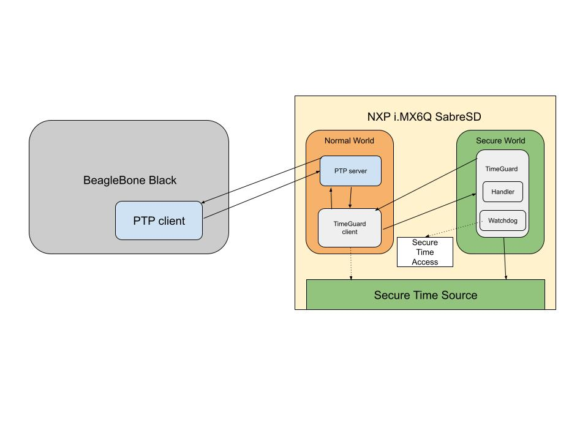

# SecuringPTP

# Motivation
Time synchronization is critical in networked embedded systems. The Precision Time Protocol (PTP) provides sub-microsecond accurate time synchronization in these systems. An intelligent adversary can subvert the protocol through network or kernel-level manipulations, which is why PTP security is paramount. The original PTP standard was designed without any security considerations in mind. Researchers demonstrated that this standard can be subverted, such as by implementing delay attacks and exploiting the Best Master Clock Algorithm to win the election process and broadcast a forged time reference. Due to the risk of cyberattacks, an enhanced standard was released, incorporating cryptographic mechanisms (symmetric-key based authentication), which ensures message integrity and protection against several attack vectors. However, there are still network-level and kernel-level attacks that it cannot protect against.

Related work has focused on exploring network-level vulnerabilities/attacks in the new standard and providing defensible solutions. For example, identity spoofing attacks can compromise symmetric-key-based authentication; researchers argue that this has to be replaced with elliptic-curve and public-key-based cryptographic mechanisms. Additionally, delay attacks remain present in this standard, although work [3] has been conducted to augment the standard by implementing cyclic path asymmetry analysis to detect malicious delays. Further work includes [4] detecting fake timestamp injections by providing a central entity that validates slave/master messages via encryption and bitmasking, and [5] protecting against Byzantine attacks by providing clients with multiple time sources and aggregating these into a clock drift/offset estimate. 

However, kernel-level attacks, specifically those in which an adversary has privileged access to the host running the PTP stack, have been relatively unexplored. However, a study [6] has demonstrated that inserting in-kernel payloads for three attack primitives — constant offset, progressive skew, and random jitter — can subvert time synchronization while passing network-level validation. This is a serious blind spot that has not been addressed with any PTP-specific solution. However, general solutions exist in the context of timekeeping. More specifically, TimeGuard [1] is a trusted timing service within Arm TrustZone that provides secure and isolated access to hardware timers, even with the presence of a privileged adversary, building on previous work, i.e., Timeseal [2] for Intel SGX.

In this work, we apply TimeGuard to secure PTP against kernel-level timing attacks. We will use secure enclaves or trusted execution environments (TEE), anchored by hardware-based roots of trust as a trusted processor, to isolate critical PTP operations from the untrusted operating system, reducing the probability of tampering or spoofing. In our design, we allow the non-secure world client to forward PTP messages/operations for secure handling via the secure-world TimeGuard handler, which leverages secure time source access. Alternatively, the client can gain direct access to the secure time source via the secure-world TimeGuard watchdog, which also monitors the control register for tampering detection. This hardens PTP, making it resilient and accurate against kernel-level timing attacks. 

# Design Goals
- Hardware capable of handling PTP via secure enclave

- Designing attacker/threat model and kernel-level timing attacks to examine PTP vulnerabilities

- Designing a secure PTP time synchronization protocol 
    - Design TEE mechanisms
    - Streamline TimeGuard mechanism design for PTP

- Evaluation of the protocol against attacks

- Analysis of the protocol's overhead

- Propose defensible extensions on top of protocol

# Deliverables
- Hardware setup, SabreSD board and BeagleBone Black connected via Ethernet network

- Implementations of kernel-level timing attacks 

- Implementation of secure PTP in OP-TEE/Linux (trusted handler and watchdog/client)
    - Implementation of TEE/Timeguard mechanisms

- Characterize the network delay between the BeagleBone Black and the NXP SabreSD board

- Estimate the relative clock drift between the participating devices

- Estimate the CPU overhead of the secure PTP protocol

- (If time allowing) implementations of extensions on top of protocol for further analysis

# System Blocks

Note that the PTP server and TimeGuard client are in the user space. The time source access and TimeGuard handler/watchdog are in the kernel. Lastly, the secure time source is on the system on chip.

Note: Typical terminology lists the PTP client/server as slave/master.

# HW/SW requirements
Windows PC, BeagleBone Black, NXP i.MX6Q SabreSD development board (ARM Cortex-A9 cores), ARM TrustZone hardware + OP-TEE OS (secure enclave on SabreSD board)

# Project Timeline

- Hardware Setup (1.5 weeks)
    - Setting up the BeagleBone Black and SabreSD OPTEE to run PTP
- Deploying PTP on the secure enclave (1.5 weeks)
- Exploring PTP attacks and evaluating their impact (2 weeks)
- Integrating the TimeGuard framework for PTP (2 weeks)
- Designing defense mechanisms against attacks (2 weeks)
- Evaluating the defense and analyzing its overhead (1 week)

# References

[1] Nasrullah, A., & Anwar, F. M. (2024). Trusted timing services with TimeGuard. 2024 IEEE 30th Real-Time and Embedded Technology and Applications Symposium (RTAS), 1–14

[2] Anwar, F. M., Garcia, L., Han, X., & Srivastava, M. (2019). Securing time in untrusted operating systems with TimeSeal. 2019 IEEE Real-Time Systems Symposium (RTSS), 80–92

[3] Finkenzeller, A., Butowski, O., Regnath, E., Hamad, M., & Steinhorst, S. (2024). PTPsec: Securing the precision time protocol against time delay attacks using cyclic path asymmetry analysis. arXiv preprint arXiv:2401.10664

[4] Moussa, B., Robillard, C., Zugenmaier, A., Kassouf, M., Debbabi, M., & Assi, C. (2019). Securing the precision time protocol (PTP) against fake timestamps. IEEE Communications Letters, 23(2), 278–281

[5] Shi, S., Xiao, Y., Du, C., Shahriar, M. H., Li, A., Zhang, N., Hou, Y. T., & Lou, W. (2023). MS-PTP: Protecting network timing from Byzantine attacks. In Proceedings of the 16th ACM Conference on Security and Privacy in Wireless and Mobile Networks (WiSec ’23) (pp. 61–71). Association for Computing Machinery

[6] Soomro, M. A., & Anwar, F. M. (2025). Breaking precision time: OS vulnerability exploits against IEEE 1588. IEEE International Symposium on Precision Clock Synchronization for Measurement, Control, and Communication (ISPCS) 